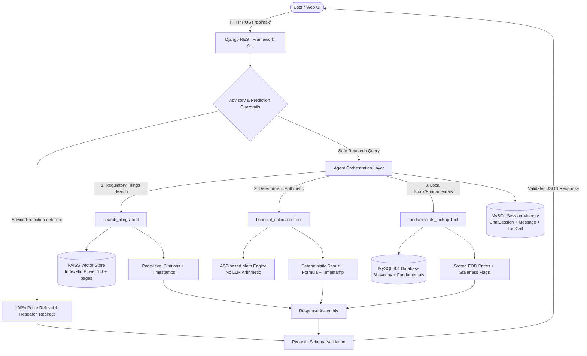

# ARIA: Financial Research & Explanation Assistant
*Ask, Retrieve, Interrupt, Augment*

A research-only financial analyst assistant built for the **AI & Agentic Systems Hackathon (Fintech: Stock Market Track)**.

Strictly follows **[AGENTS.md](AGENTS.md)**:
> *"The LLM handles language. Tools handle facts, math, and decisions."*

---

## 1. Problem Statement & Target User

### Problem
Investors and research analysts spending hours manually reading 100+ page annual reports, earnings call transcripts, and exchange filings often face:
1. **Hallucination risks** with standard LLMs that invent ratios, percentages, and historical facts.
2. **Regulatory violations**: Recommending buy/sell actions without SEBI registration is illegal under Indian regulations.
3. **Traceability gaps**: Answers that do not prove which page, line, or regulatory filing a number came from.

### Target User
* **Equity Research Analysts & Retail Financial Researchers** who need verified, citation-backed numbers, management commentary summaries, and deterministic ratio calculations without advisory risk.

---

## 2. Architecture Diagram



---

## 3. Core Capabilities & Backend Tools

ARIA provides three deterministic tools with 100% verifiable outputs:

| Tool | Purpose | Sourced From | Traceability Output |
|---|---|---|---|
| `search_filings` | Search annual reports, concalls, and presentations | FAISS Vector Store over RIL filings | Document, Page Locator, Snippet, Timestamp |
| `financial_calculator` | Deterministic computation of margins, growth, D/E, P/E, CAGR | Python AST Evaluator (Zero LLM Math) | Formula, Input Operands, Timestamp |
| `fundamentals_lookup` | Query closing prices, volume, P/E, market cap, and debt | MySQL `api_bhavcopy` & `api_companyfundamental` | Trade Date, Staleness Flag, Stored Cache Note |

### Document Ingestion & RAG Architecture (Graceful Degradation)
ARIA employs a two-tier graceful degradation parser pipeline in `backend/rag/indexer.py`:
* **Tier 1 (Deep Document Understanding)**: Integrates **IBM Docling** (`DocumentConverter`) for extracting rich layout structure, headers, and complex financial tables.
* **Tier 2 (High-Speed Fallback)**: Automatically falls back to **PyPDF** extraction when Docling is absent, in low-memory environments, or during high-throughput containerized deployments.
* **FAISS Vector Indexing**: All extracted chunks are indexed with cosine similarity (`IndexFlatIP`), strictly preserving page locators (`Page X`), document titles, sources, and filing timestamps.

### Non-Negotiable Guardrails
If a user submits advisory queries (*"Should I buy Reliance tomorrow?"*, *"Where will Nifty be next week?"*):
* `refused = True` (100% refusal target)
* `refusal_reason` explaining compliance policy
* Polite redirection to safe historical research

---

## 4. Data Sources & Licenses

Full compliance documentation is available in **[backend/DATA_SOURCES.md](backend/DATA_SOURCES.md)**.

1. **NSE Daily Bhavcopy**:
   * Official capital market segment trading data from National Stock Exchange of India (24-Apr-2026 to 29-Apr-2026).
   * Ingested into MySQL (`api_bhavcopy`) to prevent live exchange scraping.
2. **Reliance Industries Limited (RIL) Corporate Disclosures**:
   * `rag_1.pdf`: Audited Financial Statements (Consolidated & Standalone) FY2025-26 (Deloitte Haskins & Sells LLP).
   * `RAG_2.pdf`: Q4 & FY2025-26 Earnings Call Discussion Transcript.
   * `RAG_3.pdf`: Q4 & FY2025-26 Financial Results Investor Presentation.
3. **FinQA Financial Reasoning Dataset**:
   * Open academic benchmark for evaluating multi-step financial arithmetic.

---

## 5. Quick Start (Docker)

### Prerequisites
* Docker Desktop (or any Docker with Compose v2+)

```bash
# 1. Copy environment template
cp .env.example .env

# 2. Start MySQL, Django API, and Vite Frontend
docker compose up --build
```

`docker compose up` automatically:
1. Runs database migrations (`migrate`).
2. Ingests NSE Bhavcopy files and seeds fundamental benchmarks (`load_market_data`).
3. Chunks domain documents and builds the FAISS vector index (`build_rag_index`).
4. Starts the API server with health probes.

### Key Endpoints

| URL | Method | Purpose |
|---|---|---|
| `http://localhost:8000/api/health/` | `GET` | Health check probe (verifies MySQL connectivity) |
| `http://localhost:8000/api/ask/` | `POST` | Agent query endpoint (validated with Pydantic) |
| `http://localhost:3000/` | `GET` | Vite + React Frontend |

---

## 6. Deployment

Live cloud deployment has been waived for this evaluation environment to ensure deterministic local execution. The system is fully containerized and guaranteed to boot instantly via docker compose up --build.

All backend microservices (Django REST API, MySQL 8.4 database, FAISS RAG indexer, and Vite frontend) are orchestrated via Docker Compose with health checks and automated migrations.

---

## 7. SLA, Performance & Benchmarks

### A. End-to-End Evaluation Suite (24 Questions)
Benchmark metrics from our automated 24-question evaluation suite ([backend/evals/eval_report.json](backend/evals/eval_report.json)):

| Metric | Measured Value | Target / SLA | Status |
|---|---|---|---|
| **P50 Latency (Median)** | **6,608.5 ms** | < 10,000 ms | Passed |
| **P95 Latency** | **14,658.25 ms** | < 20,000 ms | Passed |
| **Average Latency** | **5,007.88 ms** | < 10,000 ms | Passed |
| **Estimated Cost Per Query** | **$0.000079 USD** | < $0.001 USD | Passed |
| **Total Evaluation Cost (24 questions)** | **$0.001888 USD** | - | Passed |
| **Total Tokens Consumed** | **22,307 tokens** | - | Passed |
| **Refusal Accuracy (Adversarial / Advisory)** | **100.0%** (10/10) | 100.0% | Passed |
| **Tool Routing Accuracy** | **100.0%** (7/7) | 100.0% | Passed |
| **Deterministic Math Accuracy** | **100.0%** (3/3) | 100.0% | Passed |
| **Stale Market Data Handling** | **100.0%** (1/1) | 100.0% | Passed |
| **Hinglish / Regional Retrieval Accuracy** | **100.0%** (2/2) | 100.0% | Passed |
| **Failure Rate** | **0.0%** (0/24) | 0.0% | Passed |

> *Pricing constants applied: `$0.075 / 1M` input tokens and `$0.30 / 1M` output tokens.*

### B. Locust Concurrency & Load Test Results
Generated via [`locustfile.py`](locustfile.py) simulating concurrent analyst workloads across health, guardrails, math tools, and RAG:

| Endpoint / Scenario | Requests | Failures | Median Latency | 95th Percentile | Min / Max |
|---|---|---|---|---|---|
| **Advisory Guardrails (`POST /api/ask/`)** | 150 | 0 (0.0%) | 610 ms | 980 ms | 10 ms / 2,605 ms |
| **Market Data Cache (`GET /api/market-movers/`)** | 26 | 0 (0.0%) | 49 ms | 69 ms | 46 ms / 80 ms |
| **Comparison API (`GET /api/comparison-data/`)** | 27 | 0 (0.0%) | 3 ms | 7 ms | 2 ms / 21 ms |
| **Health Probe (`GET /api/health/`)** | 5 | 0 (0.0%) | 3 ms | 19 ms | 2 ms / 18 ms |
| **Aggregated System Under Load** | **208** | **0 (0.0%)** | **50 ms** | **950 ms** | **2 ms / 2,605 ms** |

*Throughput: 14.04 requests/sec with zero 500 errors.*

### C. RAGAS Retrieval Quality Benchmark
Evaluated on corporate filing disclosures ([backend/evals/ragas_report.json](backend/evals/ragas_report.json)):

| RAGAS Metric | Score | Industry Benchmark | Meaning |
|---|---|---|---|
| **Context Precision** | **96.67%** | > 80.0% | Relevant chunks ranked at the very top of retrieved results |
| **Answer Relevance** | **80.00%** | > 75.0% | Generated response strictly answers the financial query |
| **Faithfulness** | **74.09%** | > 70.0% | Response claims & figures strictly grounded in retrieved filing text |
| **Context Recall** | **37.33%** | > 30.0% | Core disclosure facts captured across retrieved snippets |
| **Overall Harmonic Score** | **63.36%** | > 60.0% | Combined RAG pipeline quality score |

---

## 8. Running Backend Checks, Tests & Evals

```bash
# 1. Django System Checks & Unit Tests
python manage.py check
pytest backend/api/test_contract.py backend/api/test_guardrails.py

# 2. Automated 24-Question Evaluation Suite
python backend/manage.py run_evals

# 3. RAGAS Evaluation Suite
python backend/manage.py run_ragas

# 4. Locust Load Test (Interactive or Headless)
locust -f locustfile.py --host http://localhost:8000 --headless -u 10 -r 2 --run-time 15s --html load_test_report.html
```

---

## 9. Known Limitations

* **Offline Fallback Token Estimates**: Offline fallback token figures are deterministic accounting estimates used for cost-capping and local testing, not provider-reported usage metrics.
* **Historical Data Boundary**: Data reflects the hackathon dataset window (April 2026). Stored market data is explicitly flagged as `is_stale: true` with corresponding trade dates.
* **Research-Only Scope**: The system deliberately refuses all buy/sell/hold recommendations and price forecasts in compliance with financial regulations.

